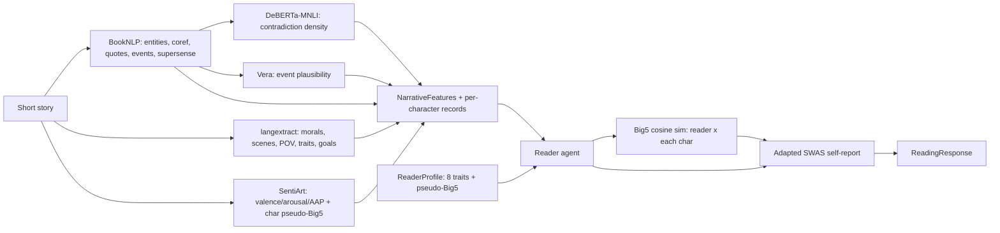

# Story2Belief — Operationalize variables and refresh tooling

## Goals

1. Lock the final variable lists for **Layer 1 (narrative features)** and **Layer 2 (reader traits)** for the 3-month prototype.
2. Convert the SWAS items into a **reusable, English-only, schema-validated instrument YAML** (no new questionnaire invented).
3. Pin down concrete usage of **BookNLP**, **`langextract`**, and **SentiArt** as three complementary Layer 1 taggers (not substitutes), plus a small set of supporting open-source models for verisimilitude and consistency.
4. Add a **pseudo-Big5 layer**: per-character (from text) and per-reader (sampled independently), with similarity-based reader-character matching.
5. **Exclude LIWC-22 from the prototype** (per your decision); document the rationale in `docs/decisions/`.

No code is written for this plan — outputs are spec/docs/configs/prompts plus minimal schema updates.

## Why BookNLP belongs alongside langextract and SentiArt

My previous draft omitted BookNLP, which was a mistake. The three tools cover different jobs and **should not be collapsed into "use langextract for everything"**:

- **BookNLP** ([`booknlp/booknlp`](https://github.com/booknlp/booknlp), 915★, MIT) — deterministic, no LLM cost. Best for the "who/what mentioned, who said what, where, when" layer: NER + cross-document character clustering (e.g. *Tom*, *Tom Sawyer*, *Mr. Sawyer* → `TOM_SAWYER`), coreference resolution, quotation speaker attribution, supersense tagging (animal / artifact / cognition / body / …), event tagging, referential gender inference. Outputs `.tokens`, `.entities`, `.supersense`. Best in class for short stories *and* novels in English.
- **`langextract`** ([`google/langextract`](https://github.com/google/langextract), 36k★, Apache 2.0) — LLM-driven structured extraction with **source grounding** (`char_interval` on every entity), schema-controlled output via few-shot examples, multi-pass + chunking for long docs, and an interactive HTML viewer. Used for **semantic / interpretive** Layer 1 features that BookNLP cannot give: moral propositions, behavioral lessons, narrative POV, scene boundaries, imagery passages, character traits/goals/backstory markers.
- **SentiArt** ([`matinho13/SentiArt`](https://github.com/matinho13/SentiArt), Jacobs 2019) — VSM-based valence/arousal/Emotion-Potential at word/scene/story level, plus **pseudo-Big5** for characters by projecting character tokens onto OCEAN seed-word axes. No dictionary required.

**Division of labour per Layer 1 family (see table below).** Output of BookNLP feeds the per-character record that SentiArt and langextract then enrich.

## Final variable lists

### Layer 1 — narrative features (10 families, with concrete taggers)

| # | Feature family | Primary tagger | Operationalization | Output fields |
|---|---|---|---|---|
| 1 | **Verisimilitude** (5 subdims, Cho et al. 2014) | **Vera** + NLI + LLM rubric | See "Verisimilitude operationalization" below | `event.plausibility`, `event.typicality`, `event.factuality`, `event.consistency`, `event.perceptual_quality` (each 0-10) |
| 2 | **Narrative consistency / coherence** (Busselle & Bilandzic 2008) | **BookNLP coref** + **DeBERTa-v3-MNLI** | See "Consistency operationalization" below | `event.coref_stability` (0-1), `event.contradiction_density` (per 100 sents) |
| 3 | **Identifiable-character density** (van Laer et al. 2014 ρ≈.20) | **BookNLP** (entities + coref + quotes) + `langextract` (traits, goals) | Count of named characters with: stable cluster + ≥1 quote + ≥1 attributed trait/goal | `character.count`, `character.salience`, `character.identifiability` |
| 4 | **Point of view / focalization** | `langextract` + pronoun-ratio heuristic from BookNLP `.tokens` | Categorical with confidence; pronoun ratio sanity-checks the LLM call | `character.pov_type`, `character.pov_confidence` |
| 5 | **Imaginable plot / scene concreteness** (van Laer et al. 2014 ρ≈.29) | **SentiArt** AAP at scene level + Brysbaert concreteness norms + BookNLP `supersense` densities (`location`, `artifact`, `body`) | Scene-level concreteness + sensory density + named-place density | `story_world.concreteness`, `story_world.sensory_density`, `story_world.named_place_density`, `story_world.aap_arc` |
| 6 | **Eventfulness / conflict density / causal clarity** | **BookNLP** event tagger + `langextract` causal-link extraction | Eventfulness = events per 100 tokens; conflict density = subset tagged `conflict`/`harm`; causal clarity = LLM-rated 0-10 with langextract grounding | existing `event.eventfulness`, `event.conflict_density`, `event.causal_clarity` |
| 7 | **Emotional intensity** | **SentiArt** | Mean EP + emotional-peak count (z-score of scene EP > 2) | `story_world.aap_mean`, `story_world.emo_peaks` |
| 8 | **Character pseudo-Big5** (NEW, per character) | **SentiArt** (label-list projection); LLM fallback | OCEAN percentiles via Jacobs 2019 seed-word method; LLM fallback uses character's quotes + actions + attributed traits from BookNLP + langextract | `character.pseudo_big5[name] = (O, C, E, A, N)` ∈ [0, 10]⁵, plus `provenance.method` ∈ {`sentiart`, `llm_fallback`} |
| 9 | **Character emotional figure profile** (Jacobs 2019) | **SentiArt** | Valence / arousal / EP percentiles within-text per character | `character.affect_map[name].{valence_percentile, arousal_percentile, ep_percentile}` |
| 10 | **Moral propositions + MFT distribution** | **`langextract`** with Hobson-style staged prompts | See "langextract for moral extraction" below | existing `moral.propositions` (now with `char_interval` provenance) |

#### Verisimilitude operationalization (new — replaces "LLM coder 0-10")

Cho et al. (2014) decompose perceived realism into five sub-dimensions. Each is best served by a different tool:

- **Plausibility** (would the events plausibly happen given commonsense?) → **Vera** ([`liujch1998/vera`](https://github.com/liujch1998/vera), T5-XXL, Apache 2.0). For each event extracted by BookNLP / langextract, build a declarative statement (e.g. *"a wolf swallows a child whole"*), call Vera, get a calibrated 0-1 plausibility score, aggregate (mean / 10th-percentile). Vera was trained on ~7M commonsense statements and outperforms GPT-3.5/4 on plausibility benchmarks. For fantasy texts, plausibility *should* drop — that's the point.
- **Typicality** (do characters/events feel representative of known cases?) → **Sentence-embedding nearest-neighbour distance** to a small reference corpus per genre (fairy tale, realistic short story). Use `sentence-transformers/all-MiniLM-L6-v2`; distance to nearest k=10 neighbours in genre = atypicality. Low cost, no LLM.
- **Factuality** (real-world named entities exist?) → **WikiData entity linking** on BookNLP entities. For each `PERSON` / `LOC` / `ORG` flagged by BookNLP, attempt resolution; ratio of resolvable entities = factuality. Optional dependency: `wikidata-graph-builder` or REL.
- **Narrative consistency** (internal coherence) → handled by family #2 below; cross-link the score here.
- **Perceptual quality** (vivid, concrete) → SentiArt AAP arc smoothness + Brysbaert concreteness mean (already in family #5); cross-link.

The LLM remains a *fallback* (single `langextract` call producing all 5 subdim scores with grounding), but the primary signal is the Vera + NLI + embedding pipeline. This is what makes verisimilitude *operationalizable* rather than a black-box LLM rating.

#### Narrative consistency operationalization (new — replaces "LLM coder 0-10")

Two complementary signals, both cheap:

1. **Coreference-chain stability** from BookNLP. For each character cluster, compute `mentions_in_cluster / total_mentions_for_canonical_name`. A story with stable coref has cluster sizes that match human intuition; broken/oversplit clusters indicate inconsistency. Aggregate as `coref_stability` ∈ [0, 1]. BookNLP big-model coref F1 is 79.0 on its training-domain texts — strong enough as a signal even if not perfect.
2. **Within-text NLI contradiction density** using `microsoft/deberta-v3-large-mnli` (or `roberta-large-mnli`). Sentence-pair the text in a sliding window (e.g. each sentence vs. the previous 5 in its scene), score each pair, count pairs where `P(contradiction) > 0.7`. Normalize per 100 sentence pairs. High contradiction density = low consistency. This is the same technique used in summarization-faithfulness work (e.g., SummaC).

These give two interpretable numbers; the prompt-level LLM rating becomes an optional sanity check rather than the primary measure.

#### Dropped from previous draft

- **Self-relevance cues** (count of second-person language, everyday contexts) — agreed: not needed for the prototype. Self-referencing is best measured *on the reader side* (`langextract` over the agent's interpretation text after reading), not as a text-side feature. Move to Year 1+ if needed.

#### Foregrounding / style deviation — explicit out-of-scope

This was the second item flagged as "Year 1+." It's the Russian-Formalist concept (Shklovsky's *ostranenie*, Mukařovský's *foregrounding*) operationalized in empirical literary studies by Miall & Kuiken (1995, 2001): **stylistic deviation from linguistic norm — phonetic, lexical, syntactic, or semantic — that arrests automatic comprehension and draws attention to the form**. In SWAS terms, foregrounding *opposes* transportation (one breaks flow, the other requires it; Kuijpers et al. 2014 explicitly note this — see their hypothesis H2).

Why out of scope for the prototype:

- Two prototype texts make norm-relative deviation metrics noisy (small N reference distribution).
- Operationalization is contested: gold-standard is hand-coding "striking" passages per 100 words (Hakemulder 2004); computational proxies (metaphor density, lexical rarity, simile count) are imperfect.
- It does not sit on the moral-transfer DV path; it's an intervening text-side mechanism that we can add in Year 1 with a larger corpus.

Kept as a documented backlog item in [`docs/04-narrative-pipeline.md`](docs/04-narrative-pipeline.md) "Year 1+ extensions."

### Layer 2 — reader traits (8 traits + 1 fit variable)

Distilled from the Core-Persuasion lit synthesis (van Laer et al. 2014 meta-analytic ρ values, Mazzocco 2010, Appel & Richter 2010, Cohen et al. 2018, Thompson et al. 2018):

- `transportability` (keep) — Mazzocco et al., strongest meta-analytic moderator (ρ≈.30).
- `need_for_affect` (keep) — Appel & Richter 2010.
- `need_for_cognition` (keep) — Zwarun & Hall 2012.
- `empathy` (keep, IRI-flavored) — Thompson et al. 2018.
- `sensation_seeking` (NEW) — Thompson et al. 2018; independent predictor of transportation across genres.
- `prior_familiarity` (rename `theme_relevance` → broader; Green 2004) — covers topic + genre + lived experience.
- `reading_exposure` (keep) — author-recognition family.
- `baseline_moral_foundation_scores` (keep, FoundationDistribution).
- **`pseudo_big5`** (NEW, 5 floats 0-10): Openness, Conscientiousness, Extraversion, Agreeableness, Neuroticism. **Sampled independently** of the other traits (per your decision) using truncated-normal with mean 5.5, sd 1.8.
- **`source_memory_decay`** (keep, secondary, for sleeper-effect modelling).

**Dropped**: `realism_preference` — too thin a construct; captured better by `sensation_seeking` (low) + `prior_familiarity` for realistic genres.

**Computed at read-time, not stored on `ReaderProfile`**:

- `reader_protagonist_big5_similarity` — cosine over the two Big5 vectors. Replaces hard-coded demographic/value-overlap slots (Cohen et al. 2018 showed raw demographic match is unreliable).
- `perceived_similarity` — elicited from the agent post-reading (1 item, 0-10), as in Ooms et al. 2019.

Drop the "demographic similarity slots" placeholder from `narrative.character` — it never belonged in the text-side schema.

### Updated pipeline diagram

## SWAS as a reusable English-only instrument

- Create `configs/instruments/swas.yaml` (new folder), the canonical scale used by all experiments. Loaded by `readers/swas.py` and referenced by `prompts/swas_self_report.prompt.md`.
- Source: `SWAS statements.pdf` and Kuijpers et al. 2014 Table 6. Final CFA-validated **18 items** (5 Attention + 5 Transportation + 5 Emotional Engagement + 3 Mental Imagery).
- Schema fields per item: `id`, `dimension`, `text_en`, `original_code` (e.g. `A1`, `T2`), `cfa_loading` (from Kuijpers 2014 Figure 1, optional). Top-level: `instrument`, `version` (`v0.1-2014cfa`), `source.citation`, `source.url`, `source.osf_validation_script` (link to OSF `mhvtb`), `license`, `scale.adapted` (0-10 probabilistic for AI readers per [`07-swas-adaptation.md`](docs/07-swas-adaptation.md)), `scale.original` (-3..+3 Likert).
- **English only.** Per your scope decision the prototype only handles English texts; German / Dutch translations are not stored. The Kuijpers paper covers them and we can add them later without schema changes (the field set is extensible by language code).
- Two SWAS adaptations recorded as separate labelled blocks in the same YAML: `additions.character_alignment` (per-character dict) and `additions.moral_uptake_confidence` (single 0-10).
- Move/delete the loose `SWAS statements.pdf` at repo root → keep it under `docs/Kuijpers et al., 2014.pdf` alongside the article (already there). The YAML is the operational source of truth; the PDF stays for citation.
- Cite the OSF R script (`https://osf.io/mhvtb`, "SWAS dimensions script.R") in the YAML and in [`docs/07-swas-adaptation.md`](docs/07-swas-adaptation.md) as the **authoritative scoring + CFA reference**: 1,919 lines of R using `psych::alpha` (Cronbach's α per dimension per study, 5 studies) and `lavaan::cfa` (first- and second-order MLR models). For Year 1+, replicate this workflow on our synthetic AI-reader cohort in Python (`semopy` / `factor_analyzer`) as a manipulation-check that synthetic responses preserve the original scale structure.

Why `configs/instruments/swas.yaml` and not `data/` or `src/.../instruments/`: experiments reference it by name like `prototype.yaml` does, it's not raw research data, and `instruments/` makes room for `mft.yaml`, `iri.yaml`, etc. later.

## `langextract` — why and how, especially for moral extraction

### Why it is a better default than raw LLM calls + JSON-mode

For every prompt in `src/story2belief/prompts/` that asks an LLM to produce structured Layer 1 output (`moral_extraction.prompt.md`, `narrative_features.prompt.md`, `narrative_feature_ordinal.prompt.md`), `langextract` gives us **four properties our hand-rolled wrappers would have to reinvent**:

1. **Source grounding by construction.** Every extracted entity carries a `char_interval = (start, end)` pointing into the source text. For moral extraction, this is huge: a moral proposition like *"loyalty matters more than truth"* is anchored to the exact passages that imply it. Downstream in Layer 3, the **justification-embedding-similarity** computation can be sharpened: instead of embedding the moral against the whole story, embed it against the *grounded supporting passage*. This tightens our DV measurement.
2. **Few-shot schema enforcement.** Instead of describing the JSON shape in prose and praying the model emits valid JSON, you provide 2–3 `ExampleData` objects with verbatim text and target extractions. The library uses controlled generation (Gemini) or JSON mode (OpenAI) to enforce the schema. Failures become explicit alignment warnings, not silent garbage.
3. **Multi-pass + chunking + parallelism out of the box.** `extraction_passes=2-3`, `max_char_buffer=1000`, `max_workers=20` — handles texts of any length without us re-implementing chunking/merge logic. Hobson-style staged moral extraction is exactly the kind of task that benefits from multiple passes (Hobson et al. 2024 themselves do staged elicitation; `langextract` makes the staging mechanical).
4. **Interactive HTML viz for free.** `lx.visualize()` produces a self-contained HTML showing every extraction highlighted in its source context — invaluable for the prototype committee demo and for QA-ing the two prototype texts.

### Concrete usage per prompt

| Prompt file | Extraction classes | What it produces |
|---|---|---|
| [`moral_extraction.prompt.md`](src/story2belief/prompts/moral_extraction.prompt.md) | `moral_proposition`, `behavioral_lesson`, `value_judgment`, `mft_evidence` | List of `MoralProposition` with text, foundation distribution, confidence, ambiguity, **and `char_interval`** for each |
| [`narrative_features.prompt.md`](src/story2belief/prompts/narrative_features.prompt.md) | `scene`, `pov_marker`, `imagery_passage`, `character_trait`, `character_goal`, `setting`, `causal_link` | Inputs for families #3, #4, #5, #6 in the table above |
| [`narrative_feature_ordinal.prompt.md`](src/story2belief/prompts/narrative_feature_ordinal.prompt.md) | One `rating` per dimension (`eventfulness`, `conflict_density`, `causal_clarity`, …) with `value: int (0-10)` and `evidence_span: str` | Ordinal Layer 1 ratings, now each anchored to the cited evidence span |

Each prompt becomes a small Python wrapper that builds the `ExampleData[]` once and calls `lx.extract(text, prompt_description, examples, model_id="gemini-2.5-flash")`. The free-form prompt text stays in `*.prompt.md`; the examples are encoded in a sibling `*.examples.py` file so they're typed and testable.

### Why this is the better decision

- **One tool, three feature families, consistent provenance** — replaces three near-identical bespoke wrappers and gives us a single retry / chunking / grounding policy.
- **Provenance is structural, not annotative** — every moral, every scene, every rating ships with a citable span, satisfying the per-record provenance rule in [`AGENTS.md`](AGENTS.md).
- **Cheap to swap models** — `model_id="gemma2:2b"` via Ollama for offline / reproducible runs, `gemini-2.5-flash` for default quality, `gpt-4o` if we need to compare. No wrapper changes.

**Tradeoff to flag:** examples can leak into outputs (the README warns about this). Mitigation: filter `[e for e in result.extractions if e.char_interval]` and add `tests/narrative/test_langextract_grounding.py` as a smoke test.

## SentiArt — concrete usage (English only)

SentiArt (Jacobs 2019) runs on top of a fastText vector space and produces valence, arousal, and Emotion Potential (EP = |valence| × arousal) for any word, plus a pseudo-Big5 profile for any name/token by projecting it onto OCEAN seed-word axes.

Mapping into Story2Belief:

- **Story- and scene-level sentiment** ([`narrative/sentiment.py`](src/story2belief/narrative/sentiment.py)):
  - Compute valence, arousal, EP for each token; aggregate by scene (from langextract scenes) and full story.
  - Output `story_world.aap_mean` and `story_world.aap_arc` (vector of scene EP percentiles) — feeds **emotional intensity** and **imaginable plot**.
  - Validated by Jacobs with R²adj = .46 on Hoffmann's *The Sandman*.
- **Per-character emotional figure profile**: `character.affect_map[name].{valence_percentile, arousal_percentile, ep_percentile}`.
- **Per-character pseudo-Big5**: `character.pseudo_big5[name] = (O, C, E, A, N)` ∈ [0, 10]⁵. Seed labels per pole encoded in `configs/instruments/sentiart_big5_seeds.yaml`. For short texts where VSM token coverage for a given character is too thin, fall back to an LLM prompt (`prompts/character_big5.prompt.md`) using BookNLP-extracted quotes + langextract-extracted traits/goals as the evidence.

Concrete plan:

- Add `SentiArt` / `fasttext` to `pyproject.toml` `nlp` extra; cite the commit SHA in `provenance.tool_versions`.
- Use the public `cc.en.300.bin` fastText vectors (English only — Russian, German, Dutch not in prototype scope).
- New file: `configs/instruments/sentiart_big5_seeds.yaml` (English seed words per OCEAN pole, with provenance to Jacobs 2019 §"Pseudo-Big 5").

## Pseudo-Big5 pipeline update

This is the conceptual upgrade you asked for — "matching" becomes an emergent similarity rather than hard-coded slots.

- **Character side**: each major character (`character.salience[name] > threshold`) gets a `pseudo_big5` vector via SentiArt (or LLM fallback when SentiArt coverage is too thin).
- **Reader side**: `ReaderProfile.pseudo_big5: tuple[float, float, float, float, float]` (O, C, E, A, N), independently sampled (truncated normal, mean 5.5 sd 1.8). [`docs/09-reader-trait-schema.md`](docs/09-reader-trait-schema.md) explicitly notes this is *not* a validated personality measurement and independence from existing traits is a deliberate prototype choice (collinearity risk at small N).
- **Matching at read-time** ([`readers/reading_loop.py`](src/story2belief/readers/reading_loop.py)):
  - Compute `sim(reader, char) = cosine(reader.pseudo_big5, char.pseudo_big5)` for each major character.
  - Pass these similarities into the SWAS-self-report prompt (`{{ character_similarity_table }}`) so the agent's character-alignment ratings are conditioned on them without being hard-coded.
  - Store the similarities on `ReadingResponse.character_similarity` for analysis.
- **Validation** (Layer 1+2 sanity check): in the prototype demo notebook, plot reader-character similarity vs. agent-reported empathy/sympathy to check the mechanism produces non-trivial variance.

## OSF `mhvtb` — what it is, and how to use it

You linked `https://osf.io/zf439/files/mhvtb`. I resolved it via the OSF API:

- **Project `zf439`**: "Story World Absorption Scale" (Kuijpers, Hakemulder, Tan, Doicaru), public, tagged `SWAS / Psychometrics / Empirical literary studies`.
- **File `mhvtb`**: `SWAS dimensions script.R`, 48 KB, 1,919 lines, posted 2021-09-10.

What it actually contains (I downloaded and inspected it):

- Loads 5 SPSS datasets (Studies 1–5 of the SWAS development programme).
- Per study, computes `psych::alpha()` for each of the four SWAS sub-scales — i.e. **the authoritative Cronbach's α calculation** for the items we are using.
- Per study, runs `lavaan::cfa()` with MLR estimator, both **first-order** (four correlated factors) and **second-order** (one absorption higher-order factor) models. This is exactly the CFA the 2014 paper visualizes in its Figure 1.

How to use it in our project:

- **As a citation in the SWAS YAML and `07-swas-adaptation.md`** — it is the authoritative scoring reference, not just our 2014-PDF reading of Table 6.
- **As a validation target for Year 1+**: when we have a synthetic cohort of 20–50 AI-readers, port the alpha / CFA workflow to Python (`semopy` or `factor_analyzer`) and run it on the synthetic responses. The expected result is *qualitatively* similar α / CFA fit to Kuijpers' human samples; **systematic divergence is itself a finding** (e.g. AI-readers are too internally consistent, indicating insufficient simulated variance).
- We do **not** need to redistribute the R code; cite it by OSF GUID.

## Additional open-source repos worth registering

These go into [`docs/12-tools-and-resources.md`](docs/12-tools-and-resources.md) as supporting / optional taggers. Pin commits when we wire them in.

| Repo | What it does | Where it fits |
|---|---|---|
| [`booknlp/booknlp`](https://github.com/booknlp/booknlp) | Entities, coref, quote attribution, supersense, event tagging for long-form English text | Primary tagger for families #3, #4, #6 |
| [`liujch1998/vera`](https://github.com/liujch1998/vera) ([HF](https://huggingface.co/liujch1998/vera)) | T5-XXL plausibility scorer over commonsense statements | Family #1, plausibility sub-dim |
| `microsoft/deberta-v3-large-mnli` (HF) | NLI classifier; used for sentence-pair contradiction density | Family #2, narrative consistency |
| [`andyreagan/core-stories`](https://github.com/andyreagan/core-stories) | Reagan 2016 emotional-arc analysis pipeline; clusters texts into six fundamental arc shapes | Optional validation for `story_world.aap_arc` (does our SentiArt arc agree with hedonometer-style decomposition?) |
| [`kirubarajan/narrative_chains`](https://github.com/kirubarajan/narrative_chains) | Chambers & Jurafsky (2008) narrative event chains; spaCy-based | Optional Year 1+ tagger for causal density beyond LLM rating |
| [`LIAAD/Text2StoryPackage`](https://github.com/LIAAD/Text2StoryPackage) | Events, participants, temporal expressions, semantic-role and objectal links | Optional Year 1+ for richer event-chain analysis |
| [`tangg555/NGEP-eventplan`](https://github.com/tangg555/NGEP-eventplan) | Graph-based event planning for stories | Year 1+, if we add scene-graph features |
| `sentence-transformers/all-MiniLM-L6-v2` (HF) | Sentence embeddings for typicality (genre-NN-distance) and justification similarity | Families #1 (typicality), Layer 3 (justification similarity) |
| [Brysbaert et al. 2014 concreteness ratings](http://crr.ugent.be/papers/Brysbaert_Warriner_Kuperman_BRM.pdf) | 40k English word concreteness ratings (CSV) | Family #5, concreteness measure |
| Piper & Bagga 2024 (ACL WNU; [paper PDF](https://aclanthology.org/2024.wnu-1.4.pdf)) | LLM annotation scheme for narrative discourse (dialogue / entities / tense / emotionality / conflict / eventfulness) over 18 genres | Reference for our `langextract` prompt designs; we can adopt their few-shot examples for narrative POV and discourse markers |
| [`hobson/llm-story-morals`](https://github.com/davidghobson1/llm-story-morals) (existing in docs/12) | Hobson et al. 2024 staged moral-extraction prompts | Templates for our `langextract` moral-extraction examples |

## LIWC-22 — excluded from the prototype

Per your decision, **LIWC-22 is excluded from the prototype.** I will not add an ADR proposing purchase. Instead:

- Add a short note to [`docs/12-tools-and-resources.md`](docs/12-tools-and-resources.md) stating LIWC-22 was evaluated and deferred: closed-source, paid, English-first, and the categories we cared about (Narrative Arc, Moralization, Perception, Analytic/Clout/Authentic/Tone) are covered well enough for the prototype by SentiArt + langextract + BookNLP supersense densities.
- Re-evaluate in Year 1 if an experiment specifically needs Boyd et al.'s Narrative Arc module or LIWC's validated linguistic-style summary variables.

## Files that will change

Schema and config:

- `src/story2belief/readers/profile.py` — add `pseudo_big5: tuple[float, ...]`, add `sensation_seeking`, drop `realism_preference`, rename `theme_relevance` → `prior_familiarity`.
- `src/story2belief/narrative/schema.py` — add `character.pseudo_big5: dict[str, tuple[float, ...]]`, `story_world.aap_arc`, `story_world.aap_mean`, `story_world.emo_peaks`; add `event.{plausibility, typicality, factuality, consistency, perceptual_quality, coref_stability, contradiction_density}`; add `valence_percentile`/`arousal_percentile`/`ep_percentile` to `CharacterAffect`.
- `configs/reader_profiles.yaml` — add Big5 sampling block, drop `realism_preference`, rename `theme_relevance` → `prior_familiarity`, add `sensation_seeking`.
- `configs/instruments/swas.yaml` — NEW, canonical 18-item English scale.
- `configs/instruments/sentiart_big5_seeds.yaml` — NEW, English OCEAN seed words per Jacobs 2019.
- `pyproject.toml` — add `booknlp`, `langextract`, `fasttext` (or `sentiart`), `transformers`, `sentence-transformers` under `[project.optional-dependencies] nlp`.

Docs:

- `docs/07-swas-adaptation.md` — link the YAML and OSF R script; lock the CFA structure; note English-only.
- `docs/08-narrative-feature-schema.md` — add new char fields, AAP arc fields, percentile fields, verisimilitude sub-dims, consistency metrics.
- `docs/09-reader-trait-schema.md` — final trait list; document independent Big5 sampling; drop `realism_preference`.
- `docs/04-narrative-pipeline.md` — name BookNLP / `langextract` / SentiArt / Vera / DeBERTa-NLI as the primary tools per feature family (the table above); add "Year 1+ extensions: foregrounding, narrative chains, story KG."
- `docs/05-reader-pipeline.md` — describe the similarity-based matching step.
- `docs/12-tools-and-resources.md` — register BookNLP (already listed but flesh out role), Vera, DeBERTa-MNLI, Reagan core-stories, narrative_chains, Text2StoryPackage, Piper & Bagga 2024, Brysbaert concreteness norms; note LIWC excluded.
- `docs/01-three-layer-architecture.md` — refresh the diagram (the one above).
- `CHANGELOG.md` — short entry per commit.

Prompts:

- `prompts/character_big5.prompt.md` — NEW, LLM fallback for character OCEAN; takes BookNLP quotes + langextract traits as evidence.
- `prompts/moral_extraction.prompt.md` — refactor to langextract few-shot format; add sibling `prompts/moral_extraction.examples.py`.
- `prompts/narrative_features.prompt.md` — refactor to langextract few-shot format; sibling `narrative_features.examples.py`.
- `prompts/narrative_feature_ordinal.prompt.md` — refactor each rating to carry an `evidence_span`.
- `prompts/swas_self_report.prompt.md` — refactor to read items from YAML; add `{{ character_similarity_table }}` slot.

## Order of operations / commit boundaries

Small, reversible commits in this order:

1. **docs-only refresh** — variable lists locked in `08-…` and `09-…`; tool table in `04-…`; arch diagram in `01-…`; tools/repos registered in `12-…` (incl. LIWC-excluded note).
2. **SWAS instrument YAML** + `07-…` update (link OSF R script) + delete the loose root-level `SWAS statements.pdf`.
3. **SentiArt Big5 seeds YAML** + `prompts/character_big5.prompt.md` skeleton.
4. **Schema updates** — `profile.py`, `schema.py`, `reader_profiles.yaml`.
5. **`langextract` prompt refactors** — `moral_extraction.*`, `narrative_features.*`, `narrative_feature_ordinal.*`.
6. **`pyproject.toml`** — declare booknlp + langextract + fasttext + transformers + sentence-transformers deps under the `nlp` extra (no code wiring yet).

I will pause for your sign-off after each commit if you want — flag in your reply if you'd prefer one big PR.

## Open questions deferred until after this plan lands

- Whether to fold the BookNLP `supersense` densities into `story_world.sensory_density` directly or keep them as a separate `supersense_distribution` field.
- Which fastText VSM size for SentiArt (`cc.en.300.bin` is 4.5 GB; might prefer `wiki.en.bin` or a domain-trained smaller VSM). Decide when the sentiment module is wired.
- Whether to add `sensation_seeking` and `prior_familiarity` to the contrast-pair table in `configs/reader_profiles.yaml` for the demo cohort.
- Whether to run Reagan core-stories on the two prototype texts as a validation of `story_world.aap_arc`, or defer to Year 1.
