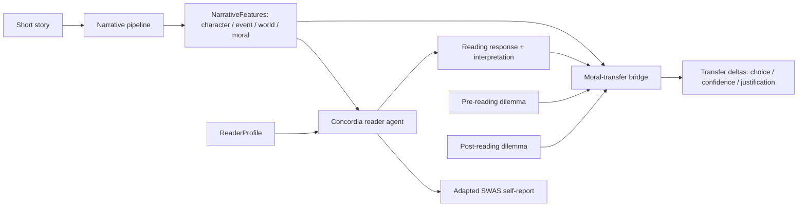

# 01 — Three-layer architecture

The system is a **three-layer pipeline** with a clear data contract between
each layer:

1. **Narrative-analysis pipeline** — text → `NarrativeFeatures`.
2. **AI-reader pipeline** — `ReaderProfile` × `NarrativeFeatures` → `ReadingResponse` (with adapted SWAS self-report).
3. **Moral-transfer bridge** — `NarrativeFeatures` + `ReadingResponse` + pre/post dilemmas → `TransferDeltas`.

## Diagram

The mermaid source is also stored at
[`diagrams/architecture.mmd`](diagrams/architecture.mmd) so it can be embedded
in slides.

## Layer contracts

### Layer 1: Narrative pipeline

- **Input**: a short story or excerpt (UTF-8 text + minimal metadata).
- **Output**: `narrative.schema.NarrativeFeatures` — structured JSON covering
  character, event, story-world, and moral feature families.
- **Implemented in**: `src/story2belief/narrative/`.
- **Key tools**: BookNLP (characters / quotes / coreference), SentiArt
  (literary sentiment), `llm-story-morals`-style staged prompts (moral
  extraction).
- **Doc**: [`04-narrative-pipeline.md`](04-narrative-pipeline.md),
  [`08-narrative-feature-schema.md`](08-narrative-feature-schema.md).

### Layer 2: AI-reader pipeline

- **Input**: a `ReaderProfile` (synthetic, theory-constrained) and a
  `NarrativeFeatures` record.
- **Output**: a `ReadingResponse` containing the adapted SWAS self-report
  (attention, emotional engagement, mental imagery, transportation) plus two
  added fields (character alignment, moral-uptake confidence) and a
  free-text interpretation.
- **Implemented in**: `src/story2belief/readers/`.
- **Key tool**: Concordia (or similar) for memory + reflection.
- **Doc**: [`05-reader-pipeline.md`](05-reader-pipeline.md),
  [`07-swas-adaptation.md`](07-swas-adaptation.md),
  [`09-reader-trait-schema.md`](09-reader-trait-schema.md).

### Layer 3: Moral-transfer bridge

- **Input**: the narrative's extracted moral propositions, the reader's
  baseline (pre-reading) dilemma response, and a matched post-reading
  dilemma response.
- **Output**: `TransferDeltas` — change in chosen option, change in
  confidence, and embedding similarity between justification and the
  story's moral.
- **Implemented in**: `src/story2belief/bridge/`.
- **Key tools**: MoralBERT for foundation scoring, sentence-transformers
  for justification similarity, MoralStory / Moral Stories / STORAL for
  the dilemma corpus.
- **Doc**: [`06-bridge-moral-transfer.md`](06-bridge-moral-transfer.md),
  [`10-dilemma-design.md`](10-dilemma-design.md).

## Why these boundaries

- **Independent debuggability** — each layer can be unit-tested with mocked
  inputs from the previous one.
- **Independent variation** — Experiment 1 fixes Layer 1 and varies Layer 2
  trait inputs; Experiment 2 fixes Layer 2 and varies Layer 1 features.
- **Substitutability** — any layer's tools can be swapped for a competing
  implementation without touching the others, as long as the schema holds.

## Open questions

- _Should `ReadingResponse` carry a passage-level attention map, or only the
  story-level SWAS averages?_
- _Where do we represent the **sleeper effect** — as a Layer-2 memory decay
  parameter, or as a Layer-3 post-hoc transformation of the response?_
